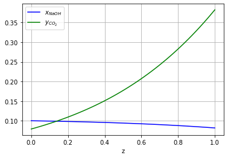

```python
import pandas as pd
import numpy as np
import matplotlib.pyplot as plt
from IPython.display import Image
#from scipy.integrate import odeint  # for comparison
```


```python
global df #dataframe
global Z  #height of total packing(m)
global Ac #cross sectional area of column(m^2)
global R #ideal gas constrant
global rhoL #liquid density
#global I #Ionic strength of solution, in this case 0.1M NaOH => 0.1
Z=1
d= 0.08 #internal diameter(m)
R=8.3145 #m^3*Pa/(mol*K)
rhoL=998 # kg/m^3 @ 20 degreeC
#I=0.05 #0.1 ionic strength

Ac=((d/2)**2)*np.pi
#df=pd.read_excel('2020 14-02 Absorption Rig.xlsx', sheet_name='in')
df = pd.read_csv('2.csv')
#df=df.iloc[16400:]
df.head()
```


<div>
<style scoped>
    .dataframe tbody tr th:only-of-type {
        vertical-align: middle;
    }

    .dataframe tbody tr th {
        vertical-align: top;
    }

    .dataframe thead th {
        text-align: right;
    }
</style>
<table border="1" class="dataframe">
  <thead>
    <tr style="text-align: right;">
      <th></th>
      <th>Time</th>
      <th>AIC0122 CO2 ppm</th>
      <th>AIC0135 CO2 ppm</th>
      <th>AIC0413 pH</th>
      <th>FIC0114 feed gas flowrate L/min</th>
      <th>FT0125 gas inlet flowrate C-1 L/min</th>
      <th>FIC0212 process water flowrate L/min</th>
      <th>FT0307 cooling water flowrate L/min</th>
      <th>FIC0408 NaOH flowrate L/min</th>
      <th>LIC0129 C-1 level %</th>
      <th>...</th>
      <th>FIC0408 sp</th>
      <th>LIC0129 sp</th>
      <th>AIC0135 sp</th>
      <th>AIC0413 sp</th>
      <th>FIC0307 sp</th>
      <th>FIC0212 sp</th>
      <th>LIC0116 sp</th>
      <th>TT0113 sp</th>
      <th>TIC0211 CC sp</th>
      <th>AIC0135 CC sp</th>
    </tr>
  </thead>
  <tbody>
    <tr>
      <th>0</th>
      <td>14:08:33.8</td>
      <td>10.0</td>
      <td>10.0</td>
      <td>10.0</td>
      <td>19.997</td>
      <td>19.997</td>
      <td>19.997</td>
      <td>19.997</td>
      <td>19.997</td>
      <td>19.997</td>
      <td>...</td>
      <td>1.0</td>
      <td>50.0</td>
      <td>5.0</td>
      <td>12.0</td>
      <td>2.0</td>
      <td>2.0</td>
      <td>30.0</td>
      <td>130.0</td>
      <td>19.0</td>
      <td>30.0</td>
    </tr>
    <tr>
      <th>1</th>
      <td>14:08:34.0</td>
      <td>10.0</td>
      <td>10.0</td>
      <td>10.0</td>
      <td>0.000</td>
      <td>0.000</td>
      <td>19.997</td>
      <td>19.997</td>
      <td>19.997</td>
      <td>19.997</td>
      <td>...</td>
      <td>1.0</td>
      <td>50.0</td>
      <td>5.0</td>
      <td>12.0</td>
      <td>2.0</td>
      <td>2.0</td>
      <td>30.0</td>
      <td>130.0</td>
      <td>19.0</td>
      <td>30.0</td>
    </tr>
    <tr>
      <th>2</th>
      <td>14:08:34.3</td>
      <td>10.0</td>
      <td>10.0</td>
      <td>10.0</td>
      <td>0.000</td>
      <td>0.000</td>
      <td>19.997</td>
      <td>19.997</td>
      <td>19.997</td>
      <td>19.997</td>
      <td>...</td>
      <td>1.0</td>
      <td>50.0</td>
      <td>5.0</td>
      <td>12.0</td>
      <td>2.0</td>
      <td>2.0</td>
      <td>30.0</td>
      <td>130.0</td>
      <td>19.0</td>
      <td>30.0</td>
    </tr>
    <tr>
      <th>3</th>
      <td>14:08:34.8</td>
      <td>10.0</td>
      <td>10.0</td>
      <td>10.0</td>
      <td>0.000</td>
      <td>0.000</td>
      <td>19.997</td>
      <td>19.997</td>
      <td>19.997</td>
      <td>19.997</td>
      <td>...</td>
      <td>1.0</td>
      <td>50.0</td>
      <td>5.0</td>
      <td>12.0</td>
      <td>2.0</td>
      <td>2.0</td>
      <td>30.0</td>
      <td>130.0</td>
      <td>19.0</td>
      <td>30.0</td>
    </tr>
    <tr>
      <th>4</th>
      <td>14:08:35.3</td>
      <td>10.0</td>
      <td>10.0</td>
      <td>10.0</td>
      <td>0.000</td>
      <td>0.000</td>
      <td>19.997</td>
      <td>19.997</td>
      <td>19.997</td>
      <td>19.997</td>
      <td>...</td>
      <td>1.0</td>
      <td>50.0</td>
      <td>5.0</td>
      <td>12.0</td>
      <td>2.0</td>
      <td>2.0</td>
      <td>30.0</td>
      <td>130.0</td>
      <td>19.0</td>
      <td>30.0</td>
    </tr>
  </tbody>
</table>
<p>5 rows × 51 columns</p>
</div>


# Reference of all the used correlations

Analytical solution:

$K_{og}A_e = \frac{u_g}{ZRT} \cdot \ln(\frac{y_{in}}{y_{out}})$

$K_{og}A_e = \frac{G}{PZ} \cdot \ln(\frac{y_{in}}{y_{out}})$

where, G: total mole gas flow rate ($mol\cdot m^{-2}\cdot s^{-1}$)

$\frac{1}{K_{og}}=\frac{1}{k_G}+\frac{H_{CO_2}}{Ek_L}$

$k_{L,mod}=\frac{Ek_L}{H_{CO_2}}=\frac{H_{CO_2}}{\sqrt{k_{OH^-}[OH^-]D_{CO_2 , L}}}$,

$k_g = 0.0338\left( \frac{D_G}{d_h}\right)\left( \frac{\rho_G V d_h}{\mu_G cos45^{\circ}} \right)^{0.8} \left( \frac{\mu_G}{\rho_G D_G} \right)^{1/3}$

[https://pubs.acs.org/doi/pdf/10.1021/ie00027a023?casa_token=_wA_l-BR36AAAAAA:zA0Wt0cMwDVwDrjXUv3Uri6BZc3aHSYHglZF6u7Yjv--2Aas2hzL2zMkIQAYOsp-Cb-ZzzT07ceMhw]

$\lg \frac{H_{CO_2}}{H_{CO2},water} = \sum{I_i h_i}$, $h_i = h_+ + h_- +h_g$

$\lg H_{CO_2,water}= -9.1229+5.9044\times 10^{-2}T-7.8857\times 10^{-5}T^2$ $((m^3\cdot atm)/kmol)$

$\lg K_{OH^-} = 11.895-\frac{2382}{T} + 0.221I-0.016I^2$, $I$, ionic strength of solution $(m^3/(kmol\cdot s))$

$\lg D_{CO_{2,water}} = -8.1764+ \frac{712.5}{T} - \frac{2.591\times 10^5}{T^2}$ $(m^2 /s)$

All the above 3 correlations are from:
[https://reader.elsevier.com/reader/sd/pii/0009250988851595?token=3233537836EE34092203E3AE93807AB8F9DCC7277D8EAF2AAD0551BC2C86F6D5FAA56540D412B5FEFF7DBC07CDA1F9E4]


```python
Image("packing.png")
```


    

    


Effective mass transfer area:

$\frac{a_{e}}{a_{p}}=1.34\left[(\frac{\rho_{L}}{\delta})g^{1/3}\left(\frac{Q}{L_{p}}\right)^{4/3}\right]^{0.116}$

$L_p = \frac{4S}{Bh}A$

[https://aiche.onlinelibrary.wiley.com/doi/epdf/10.1002/aic.12345?saml_referrer]

Alternative:
$\frac{a_e}{a_p}=0.465 Re_L ^{0.3}$

https://pubs.acs.org/doi/pdf/10.1021/ie00027a023

where
$Re=\frac{\rho_L u_L}{\mu_L A_p}$, $u_L$, superficial velocity: $Q/A_c$

$\delta = \sqrt[3]{\frac{3\mu_{L}}{\rho_{L}gsin\alpha} \left(\frac{Q}{L_{p}}\right)}$


```python
#Packing specs
global Ap
Ap= 350 #(m^2/m^3)
'''
def cal_nusselt(i): #ith row

'''
```


    '\ndef cal_nusselt(i): #ith row\n\n'


```python
Image("Operator UI.png")
```


    

    


$\frac{a_{e}}{a_{p}}=1.34\left[(\frac{\rho_{L}}{\delta})g^{1/3}\left(\frac{Q}{L_{p}}\right)^{4/3}\right]^{0.116}$

Alternative:
$\frac{a_e}{a_p}=0.465 Re_L ^{0.3}$

where
$Re=\frac{\rho_L u_L}{\mu_L A_p}$, $u_L$, superficial velocity: $Q/A_c$


```python
def cal_Ae(i): #ith row
    #not yet find the refine version of Ae
    Q= df.iloc[i,8] #FIC0408 (L/min)
    uL=(Q*1.66667e-5)/Ac # liquid superficial velocity (m/*s)
    muL = 1.002e-3 # (Pa*s) or (kg/(m*s)) @ 20 degreeC
    Re=(rhoL*uL)/(muL*Ap)
    return Ap*0.465*(Re**0.3)
```

The goal here is trying to computer the K_OG calculated from experiment and direct correlations from k_l, k_g
* Column tempt. approximated by TT0126

$K_{og}A_e = \frac{u_g}{ZRT} \cdot \ln(\frac{y_{in}}{y_{out}})$


```python
# need function to calculate A_e, effective mass transfer area
def cal_Kog(i): #ith row
    Ae=cal_Ae(i)
    Vdot = df.iloc[i,5] #FT0125 gas inlet flowrate C-1 L/min (convert to m^3/s in cal)
    T= 273.15+df.iloc[i,32] #TT0126
    yin=df.iloc[i,1]; yout=df.iloc[i,2]
    Kog=Vdot*1.66667e-5*np.log(yin/yout)/(R*T*Ac*Z*Ae) # mol/(m^2 * Pa *s)
    return Kog
```


```python
print(cal_Kog(8027))
```

    1.807151825124247e-08
    


```python
print(df.iloc[8027,0])
```

    15:15:26.8
    


```python
cal_Ae(8027)
```


    100.1426655677776


$\frac{1}{K_{og}}=\frac{1}{k_G}+\frac{H_{CO_2}}{Ek_L} \rightarrow \frac{1}{K_{og}}\approx \frac{H_{CO_2}}{\sqrt{k_{OH^-}[OH^-]D_{CO_2 , L}}}$, $k_{L,mod}=\frac{Ek_L}{H_{CO_2}}$

$\lg \frac{H_{CO_2}}{H_{CO2},water} = \sum{I_i h_i}$, $h_i = h_+ + h_- +h_g$

$\lg H_{CO_2,water}= -9.1229+5.9044\times 10^{-2}T-7.8857\times 10^{-5}T^2$ $((m^3\cdot atm)/kmol)$

$\lg K_{OH^-} = 11.895-\frac{2382}{T} + 0.221I-0.016I^2$, $I$, ionic strength of solution $(m^3/(kmol\cdot s))$

$\lg D_{CO_{2,water}} = -8.1764+ \frac{712.5}{T} - \frac{2.591\times 10^5}{T^2}$ $(m^2 /s)$

Seems only considering $k_l$ is not enough

$k_g = 0.0338\left( \frac{D_G}{d_h}\right)\left( \frac{\rho_G V d_h}{\mu_G cos45^{\circ}} \right)^{0.8} \left( \frac{\mu_G}{\rho_G D_G} \right)^{1/3}$

where
$d_h = \frac{4\epsilon}{A_p}$


```python
# For calculating the K_og directly, try to validate if it is ok to ignore kg
def cor_Kog(i):
    I=0.1
    T= 273.15+df.iloc[i,32]
    kOH=10**(11.895 - (2382/T) +0.221*I-0.016*(I**2))
    '''
    kOHinf=10**(11.895-(2382/T))
    kOH=(10**(0.221*I-0.0113*(I**2)))*kOHinf
    '''
    
    DL=10**(-8.1764+ (712.5/T) - (2.591e5)/(T**2))
    HW=10**(-9.1229+(5.9044e-2)*T-(7.8857e-5)*(T**2))
    H=((10**(I*(0.091+0.066-0.019)))*HW)*100
    kLmod=np.sqrt(kOH*I*0.05*DL)/H # NOTE! the conc. HERE!
    
    DG=10000*DL
    dh=4/Ap
    V= df.iloc[i,5] #FT0125 (L/min)
    uL=(V*1.66667e-5)/Ac # liquid superficial velocity (m/*s)
    muG= 1.849e-5 # air viscosity @ 25 degreeC (kg/(m*s))
    rhoG = 1.184 # air density @ 25 degreeC (kg/m^3)
    kg=0.0338*(DG/dh)*(((rhoG*V*dh)/(muG*np.cos(np.pi/4)))**0.8)*((muG/(rhoG*DG))**(1./3))*1000
    
    ans=1/kLmod + 1/kg
    return (1/ans)
```


```python
print(cor_Kog(6065))
```

    8.416244129192474e-08
    


```python
i=6065
T= 273.15+df.iloc[i,32]
DL=10**(-8.1764+ (712.5/T) - (2.591e5)/(T**2))
DL
```


    1.6226559170118134e-09


```python
def cal_yout(i):
    Kog=cor_Kog(i)
    Ae= cal_Ae(i)
    Vdot = df.iloc[i,5] #FT0125 gas inlet flowrate C-1 L/min (convert to m^3/s in cal)
    T= 273.15+df.iloc[i,32] #TT0126
    yin=df.iloc[i,1];
    yout=yin*(np.exp(-(Kog*Ae*R*T*Ac*Z)/(Vdot*1.66667e-5)))
    return yout
```


```python
rownum = df.shape[0]
exp=[]; cor=[]; arr=[]; ydiff=[]; phin=[]; phout=[]; ratio=[]; V=[]; Q=[]; K_og=[];
for i in range(0,rownum):
    exp.append(df.iloc[i,2])
    cor.append(cal_yout(i))
    ydiff.append(df.iloc[i,1]-df.iloc[i,2])
    phin.append(df.iloc[i,35])
    phout.append(df.iloc[i,3])
    V.append(df.iloc[i,5]/80)
    Q.append(df.iloc[i,8]/2.5)
    K_og.append(cor_Kog(i))
    '''
    tempratio=df.iloc[i,5]/df.iloc[i,8]
    if tempratio > 32:
        ratio.append(0)
    else:
        ratio.append(tempratio)
    '''
    ratio.append(df.iloc[i,5]/df.iloc[i,8])
    arr.append(i)
```

    C:\Users\TonyZ\Anaconda3\lib\site-packages\ipykernel_launcher.py:24: RuntimeWarning: divide by zero encountered in double_scalars
    C:\Users\TonyZ\Anaconda3\lib\site-packages\ipykernel_launcher.py:7: RuntimeWarning: invalid value encountered in double_scalars
      import sys
    


```python
fig, (ax1,ax2,ax3) = plt.subplots(3,1)
ax1.plot(arr,exp)
ax1.plot(arr,cor)
ax1.legend(['experiment','correlation'])
ax2.plot(arr, ydiff); ax2.plot(arr,phin); ax2.plot(arr,phout)
ax2.legend(['yin-yout', 'pH-in','pH-out'])
ax3.plot(arr,ratio)
ax3.legend(['Gas:liquid flowrate ratio'])
```


    <matplotlib.legend.Legend at 0x17f401d3da0>


    

    


```python
fig, (ax4,ax5) = plt.subplots(2,1)
ax4.plot(arr, V); ax4.plot(arr, Q);
ax4.legend(['Gas flow rate(max80)', 'Liquid flow rate(max2.5)'])
ax5.plot(arr,K_og); ax5.set_yscale('log')
ax5.legend(['K_og'])
plt.show()
```


    

    


$\frac{dy}{dz}=-\frac{K_{og}(x)A_e RT}{u_g}y\\
\frac{dx}{dz}=\frac{K_{og}(x)A_e RT}{u_g}y\cdot \frac{2V}{L}$

$y=[x \quad y]\\
y_0 = [x_{bguess} \quad y_{in}]$


```python
# For calculating the K_og directly, try to validate if it is ok to ignore kg
def cor_Kog2(T,I):
    kOH=10**(11.895 - (2382/T) +0.221*I-0.016*(I**2))
    '''
    kOHinf=10**(11.895-(2382/T))
    kOH=(10**(0.221*I-0.0113*(I**2)))*kOHinf
    '''
    
    DL=10**(-8.1764+ (712.5/T) - (2.591e5)/(T**2))
    HW=10**(-9.1229+(5.9044e-2)*T-(7.8857e-5)*(T**2))
    H=((10**(I*(0.091+0.066-0.019)))*HW)*100
    if I <0:
        #raise Exception('The NaOH conc is %0.3f \n' % I)
        print('Warning, I <0')
        I=0
    kLmod=np.sqrt(kOH*I*DL)/H # NOTE! the conc. HERE!
    
    DG=100000*DL
    dh=4/Ap
    muG= 1.849e-5 # air viscosity @ 25 degreeC (kg/(m*s))
    rhoG = 1.184 # air density @ 25 degreeC (kg/m^3)
    kg=0.0338*(DG/dh)*(((rhoG*V*dh)/(muG*np.cos(np.pi/4)))**0.8)*((muG/(rhoG*DG))**(1./3))*1000
    
    ans=1/kLmod + 1/kg
    return (1/ans)
```


```python
def cal_Ae2(Q): #ith row
    #not yet find the refine version of Ae
    uL=(Q*1.66667e-5)/Ac # liquid superficial velocity (m/*s)
    muL = 1.002e-3 # (Pa*s) or (kg/(m*s)) @ 20 degreeC
    Re=(rhoL*uL)/(muL*Ap)
    return Ap*0.465*(Re**0.3)
```


```python
def pend(y, z, T, Q, V ):
    # T: degree C [i,32] Q: liquid flowrate iloc[i,8] FIC0408 (L/min) 
    # V: gas flowrate [i,5] (L/min)
    T=T+273.15 # K
    Kog=cor_Kog2(T,y[0])
    G=((1.1e5)*V*(1.66667e-5))/(R*T)
    Ae=cal_Ae2(Q)
    ug=(V*1.66667e-5)/Ac
    var= Kog*Ae*R*T/ug
    return np.array([var*y[1]*2*(G/Q), -var*y[1]])

def pend2(y, z, T, Q, V ):
    # T: degree C [i,32] Q: liquid flowrate iloc[i,8] FIC0408 (L/min) 
    # V: gas flowrate [i,5] (L/min)
    T=T+273.15 # K
    Kog=cor_Kog2(T,y[0])
    G=((1.1e5)*V*(1.66667e-5))/(R*T)
    Ae=cal_Ae2(Q)
    ug=(V*1.66667e-5)/Ac
    var= Kog*Ae*R*T/ug
    return np.array([-var*y[1]*2*(G/Q), var*y[1]])
```


```python
i=4500
T=df.iloc[i,32]; Q=df.iloc[i,8]; V = df.iloc[i,5]; yin= df.iloc[i,1]/100
numcell = 50
xbguess=0.0006
dz=np.linspace(0,Z,numcell)
y0=np.array([xbguess,yin])
y0top=np.array([0.1,0.079])
```


```python
print('y_out is %0.4f   y_in is %0.4f' % (df.iloc[i,2],df.iloc[i,1]))
```

    y_out is 7.9100   y_in is 10.2510
    


```python
G=((1.1e5)*V*(1.66667e-5))/(R*(T+273.15))
print('CO2 molar flowrate is %0.5f mol/s, Liquid flowrate is %0.3f L/s' % (G*yin,Q/60) )
```

    CO2 molar flowrate is 0.00465 mol/s, Liquid flowrate is 0.025 L/s
    


```python
ph=df.iloc[i,3]; outph=10**(-(14-ph))
print('pH is %0.3f \nOutlet OH- is %0.4f M' % (ph, outph))
```

    pH is 10.810 
    Outlet OH- is 0.0006 M
    


```python
G
```


    0.04534753228910559


```python
V
```


    59.849


```python
Q
```


    1.505


```python
uL=(Q*1.66667e-5)/Ac
uL
```


    0.0049901805918683585


```python
def rungekutta1(f, y0, t, args=()):
    n = len(t)
    y = np.zeros((n, len(y0)))
    y[0] = y0
    for i in range(n - 1):
        y[i+1] = y[i] + (t[i+1] - t[i]) * f(y[i], t[i], *args)
    return y
```


```python
def rungekutta2(f, y0, t, args=()):
    n = len(t)
    y = np.zeros((n, len(y0)))
    y[0] = y0
    for i in range(n - 1):
        h = t[i+1] - t[i]
        y[i+1] = y[i] + h * f(y[i] + f(y[i], t[i], *args) * h / 2., t[i] + h / 2., *args)
    return y
```


```python
#sol = odeint(pend, y0,dz, args=(T,Q,V))
sol = rungekutta1(pend, y0, dz, args=(T,Q,V))
```


```python
plt.plot(dz, sol[:, 0], 'b', label=r'$x_{NaOH}$')
plt.plot(dz, sol[:, 1], 'g', label=r'$y_{CO_2}$')
plt.xlabel('z')
plt.legend(loc='best')
plt.grid()
plt.show()
```


    

    


```python
sol = rungekutta2(pend, y0, dz, args=(T,Q,V))
```


```python
plt.plot(dz, sol[:, 0], 'b', label=r'$x_{NaOH}$')
plt.plot(dz, sol[:, 1], 'g', label=r'$y_{CO_2}$')
plt.xlabel('z')
plt.legend(loc='best')
plt.grid()
plt.show()
```


    

    


```python
sol = rungekutta1(pend2, y0top, dz, args=(T,Q,V))
```


```python
plt.plot(dz, sol[:, 0], 'b', label=r'$x_{NaOH}$')
plt.plot(dz, sol[:, 1], 'g', label=r'$y_{CO_2}$')
plt.xlabel('z')
plt.legend(loc='best')
plt.grid()
plt.show()
```


    

    


```python

```
